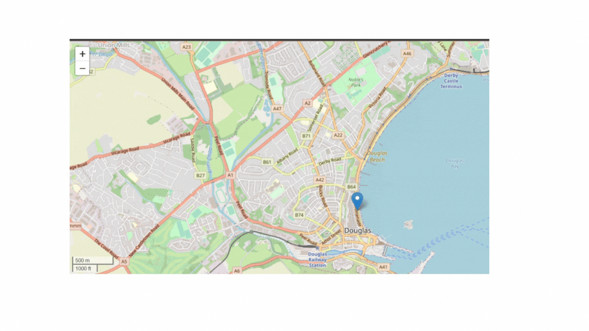
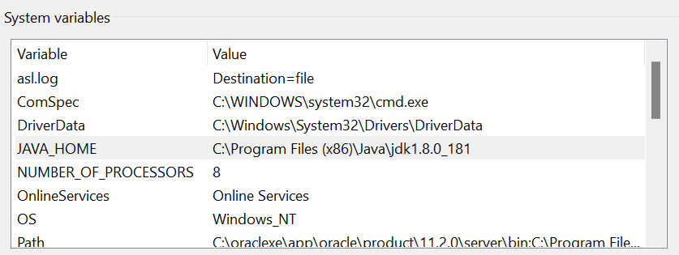
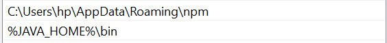
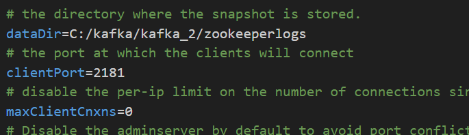
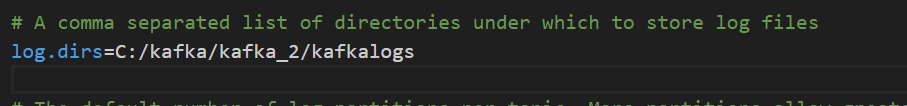

# Live_tracking_example-using-python-kafka-osm

## DEMO

## First Install Kafka 
1. You Will need to install java(64 bit)
2. After installing extract and install
3. Find the jdk file and copy the path to it 
4. For windows open environment variables and add the path to System variables and JAVA_HOME (example:-C:\Program Files (x86)\Java\jdk1.8.0_181)
   
   
5. In *USER* variables click on path and add a new one in the bottom as %JAVA_HOME%\bin
   
   
6. Install apache kafka and extract and rename the long file names to just kafka (remove the version)
7. Copy the path to the bin folder example(C:\Users\hp\Downloads\kafka\kafka\bin)
8. Go back to environment variables and under *USER* variables install
9. Create two folders inside the kafka folder name it zookeeper-log and kafka-logs 
10. Inside the config folder open zookeeper.properties and change the dataDir to the path of zookeeper-log folder
    
    
11. Inside the config folder open server.properties and change the logs.dir to the path of kafka-logs folder
    
    
12. Change \ to / in the path names if it is not
13.change the path to your bin folder inside kafka

>cd C:\Kafka\kafka\bin\windows

>zookeeper-server-start.bat C:\Kafka\kafka\config\zookeeper.properties
>kafka-server-start.bat C:\Kafka\kafka\config\server.properties

>kafka-topics.bat --create --bootstrap-server localhost:9092 --topic testfinal

14.To create a topic name with testfinal 

>kafka-console-producer.bat --broker-list localhost:9092 --topic testfinal

15. Creates a producer

>kafka-console-consumer.bat --topic testfinal --bootstrap-server localhost:9092 --from-beginning

16.Creates a consumer

        
